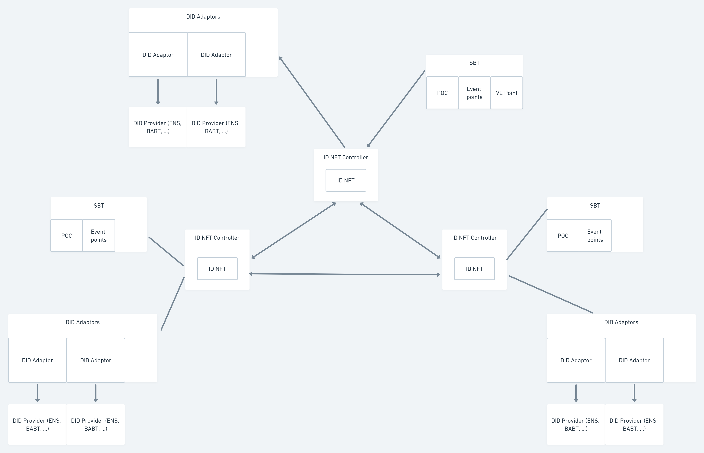

# Sample Hardhat Project

This project demonstrates a basic Hardhat use case. It comes with a sample contract, a test for that contract, and a script that deploys that contract.

Try running some of the following tasks:

```shell
npx hardhat help
npx hardhat test
GAS_REPORT=true npx hardhat test
npx hardhat node
npx hardhat run scripts/deploy.js
```

# MultiDAO contracts

## Architecture


## ID NFT features
### Claimable on multiple chains
ID NFT serves as the account system of MultiDAO. ID NFTs are claimable on all supported
chains with a different prefix, so the token ID is unique in the entire Multiverse.

### Register to remote chain

### Binding to accounts of other digital identity protocol
The controller contract allows ID NFT holders to prove they are real users by
connecting to a digital identity (DID) account. It utilizes adaptors to interact
with 3rd party DID providers.

The first supported DID system is BABT.

Upper-layer applications (like SBT and reward distributor) can retrieve underlying DID
information of ID NFTs in the controller contract and the adaptor contract.

### Mergeable

### Ledgers
Upper layer applications will get registered in the controller as ledgers and
provide a hook function `merge`. The controller will call `merge` when two ID
NFTs merge into one and let upper-layer applications check their status and
keep consistent.

The SBT contract is registered as a ledger. It will clear SBT points of one ID
NFT and add to another when merging two ID NFTs.

## SBT
### Hierarchically controllable
### Mergeable